# Проект GPS Warehouse App
## Техническое задание
Разработать мобильное приложение на основе API системы GPS RS с реализацией следующего функционала:
- [X] Авторизация
- [X] Профиль пользователя
- [X] Формирование заказа
- [X] Список материалов на складе
- [X] Распознавание разных QR и Barcode
- [X] Проведение инвентаризации
- [X] Приемка материалов 
- [X] Автофокус на поле количество
- [X] История перемещений (Архив)
- [X] Перемещение материалов + Складские запросы
- [X] Автоматический выход при истечении токена
- [X] Автоматический выход после 12 часов после авторизации
- [X] Логика обновления приложения
- [X] Разделение на вкладки
- [X] Настройка темной темы
- [X] Сканирование для устройств Honeywell и Zebra

## Описание
Мобильное приложение для Android, разработанное специально для терминалов сбора данных (ТСД) **Honeywell EDA52** (Android 11). 

Приложение интегрируется с системой управления складом **GPS RS**. 

Предназначено для автоматизации ключевых складских операций: 
- Приемки
- Отгрузки
- Инвентаризации
- Перемещения материалов
- Формирования заказов

## Основные возможности
### Авторизация и Безопасность
- Безопасный вход с использованием **RSA-шифрования** пароля.
- Получение публичного ключа с сервера перед отправкой данных.
- Использование **JWT-токенов** для аутентификации сессий.
- Автоматическое завершение сессии через 12 часов неактивности.

### Управление заказами
- **Список активных заказов**: Просмотр заказов со статусами "Новый", "В пути", "Отправлен".
- **Архив заказов**: История выполненных и спорных заказов.
- **Детализация заказа**: Просмотр списка материалов, требуемых количеств и статусов.
- **Приемка материалов (Receive)**:
  - Сканирование QR-кодов для привязки уникального кода упаковки к материалу.
  - Редактирование количества перед подтверждением.
  - Отправка данных на сервер через эндпоинт `matdoneps`.

### Формирование заказов (Packaging)
- Создание новых заказов на перемещение материалов.
- Добавление товаров через сканер штрихкодов или вручную.
- Автоматический переход к экрану приемки сразу после создания заказа.

### Инвентаризация
- Список активных и завершенных инвентаризаций.
- Сверка фактического остатка с плановым количеством.
- Визуальная подсветка успешных сверок (зеленый) и расхождений/ошибок (красный).
- Возможность завершения инвентаризации с блокировкой дальнейшего редактирования.

### Складской учет и WMS
- **Просмотр остатков**: Фильтрация материалов по складам, датам и артикулам.
- **Перемещение материалов (WMS)**:
  - Быстрое перемещение товара между складами через удобный диалог.
  - Выбор целевого склада из списка доступных.
  - Валидация количества (нельзя переместить больше, чем есть в наличии).
- **Складские запросы**: Просмотр исходящих и входящих запросов на перемещение.

### Профиль пользователя
- Просмотр информации о пользователе (логин, отдел, последний вход).
- Отображение прав доступа к конкретным складам.

---

## Технологический стек

| Категория               | Технологии                                                  |
|:------------------------|:------------------------------------------------------------|
| **Язык**                | Kotlin                                                      |
| **UI Toolkit**          | Jetpack Compose (Material 3)                                |
| **Архитектура**         | MVVM (Model-View-ViewModel)                                 |
| **DI**                  | Hilt (Dagger)                                               |
| **Сеть**                | Retrofit + OkHttp (Logging Interceptor, Custom CookieJar)   |
| **Локальное хранилище** | Jetpack DataStore (Preferences) для токена и времени сессии |
| **Асинхронность**       | Kotlin Coroutines + Flow                                    |
| **Навигация**           | Jetpack Navigation Compose                                  |
| **Оборудование**        | Honeywell AIDC SDK (для встроенного сканера штрихкодов)     |
| **Парсинг данных**      | Gson, Base64 decoding, JSON parsing                         |

---

## Структура проекта

```text
com.gps.warehouse/
├── data/
│ ├── local/                        # TokenStorage (DataStore), PersistentCookieJar
│ └── remote/                       # ApiService (интерфейс API), DTOs (Data Transfer Objects)
│
├── di/ # Hilt Modules
│ ├── AppModule.kt                  # Предоставление TokenStorage
│ └── NetworkModule.kt              # Настройка Retrofit, OkHttpClient, Gson
│
├── ui/
│ ├── screens/                      # Экраны приложения (Login, Home, Orders, WMS, Inventory и др.)
│ ├── components/                   # Переиспользуемые UI-компоненты
│ │     ├── MyCustomActionBar.kt    # Кастомный AppBar с кнопкой назад
│ │     ├── ErrorStateView.kt       # Унифицированный экран ошибки с авто-повтором
│ │     └── CustomLoadingView.kt    # Индикатор загрузки
│ ├── MainActivity.kt               # Точка входа UI, настройка NavHost
│ └── MainViewModel.kt              # Единая точка управления состоянием UI и бизнес-логикой
│
├── utils/ # Утилиты
│ ├── BarcodeParser.kt              # Парсер штрихкодов (Plain text / Base64 JSON)
│ ├── RsaUtils.kt                   # Шифрование пароля RSA
│ ├── ScannerManager.kt             # Универсальный менеджер сканеров (диспетчер)
│ ├── HoneywellAidcHelper.kt        # Обертка над SDK Honeywell для сканирования
│ ├── ZebraEmdkHelper.kt            # Обертка над SDK Zebra EMDK для сканирования
│ └── Constants.kt                  # Константы (URL, таймауты)
└── App.kt                          # Application class с @HiltAndroidApp
```

---

## Скриншоты интерфейса

### Авторизация и Профиль
| Экран авторизации                                  | Профиль пользователя                                     |
|----------------------------------------------------|----------------------------------------------------------|
| 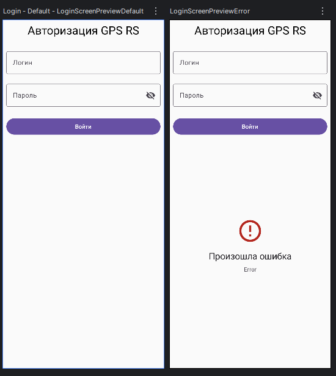 | 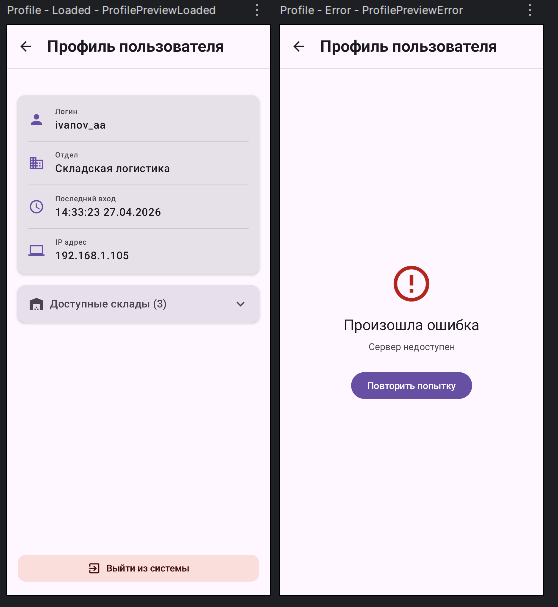 |

### Главная
| Главный экран                                   |
|-------------------------------------------------|
| 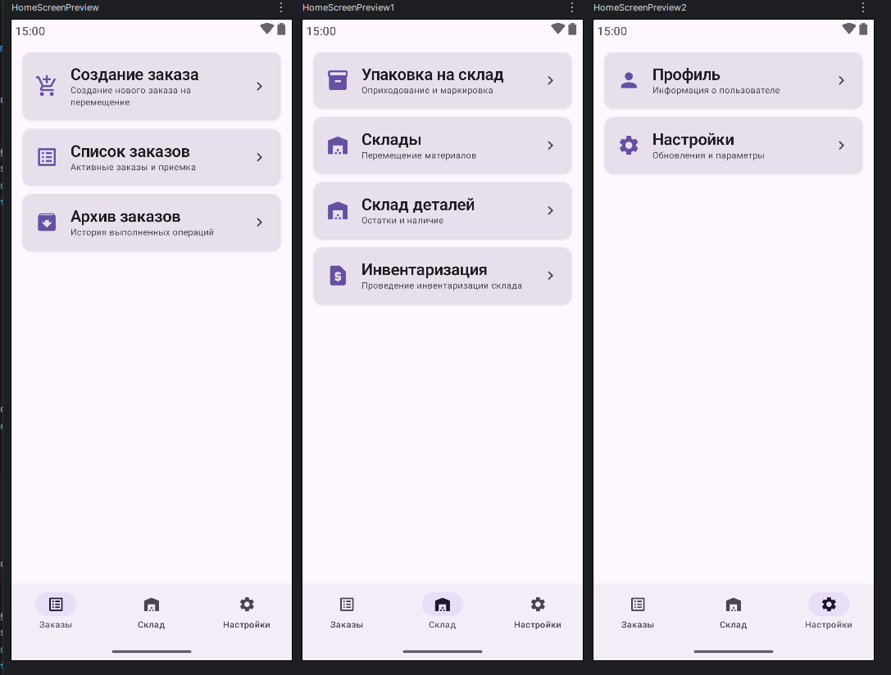 |

### Управление заказами
| Список заказов                                            | Детали заказа                                                      |
|-----------------------------------------------------------|--------------------------------------------------------------------|
| 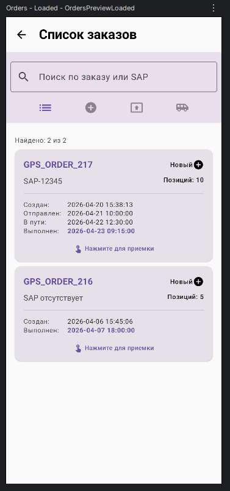 | 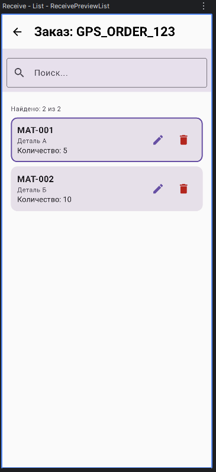 |

### Приемка материалов (Receive)
| Экран приемки                                                  |
|----------------------------------------------------------------|
| 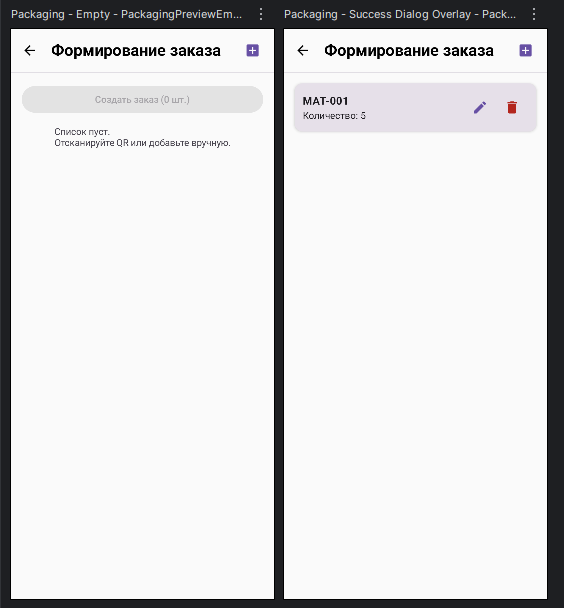 |

### Инвентаризация
| Список инвентаризаций                                                   | Сверка материалов                                                         |
|-------------------------------------------------------------------------|---------------------------------------------------------------------------|
| 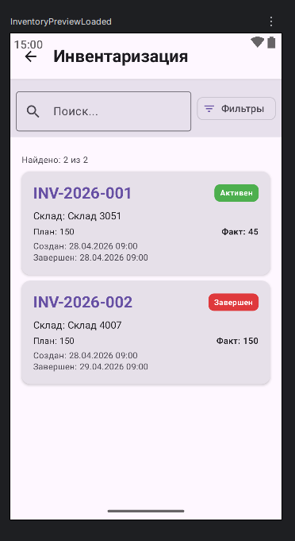 | 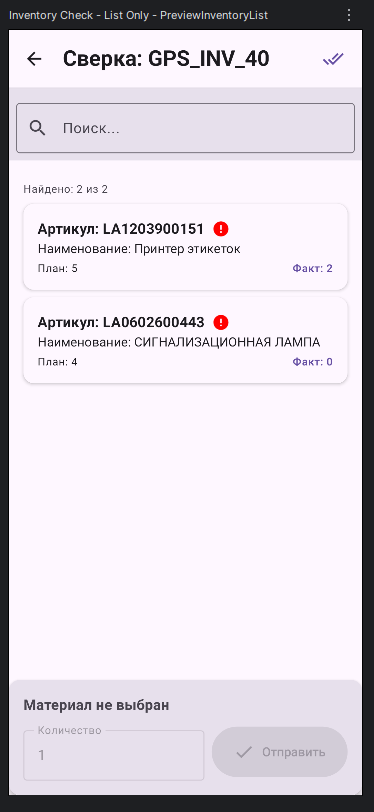 |

### Складской учет (WMS)
| Склад                                              | Материалы на складе                                                               | Запросы на перемещение                                              |
|----------------------------------------------------|-----------------------------------------------------------------------------------|---------------------------------------------------------------------|
| 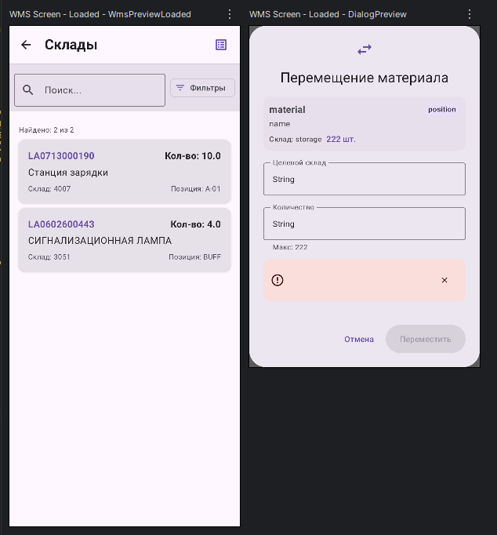 | 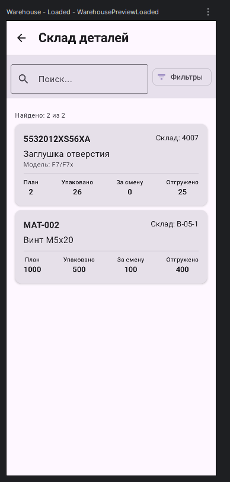 | 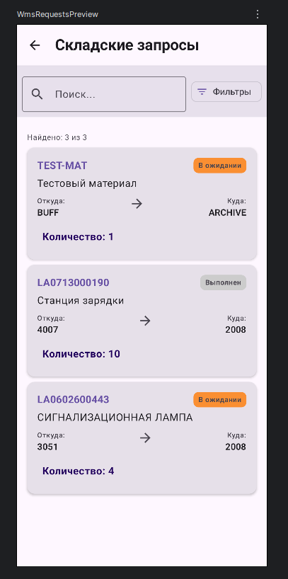 |

### Перемещение на склад
| Перемещение на склад                                                               |
|------------------------------------------------------------------------------------|
| 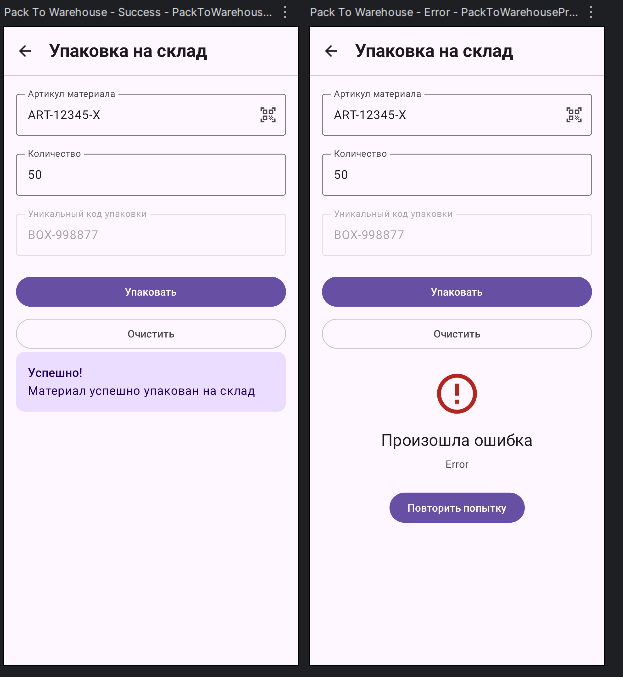 |

### Архив
| Архив заказов                                            | Детали архива                                                           |
|----------------------------------------------------------|-------------------------------------------------------------------------|
| 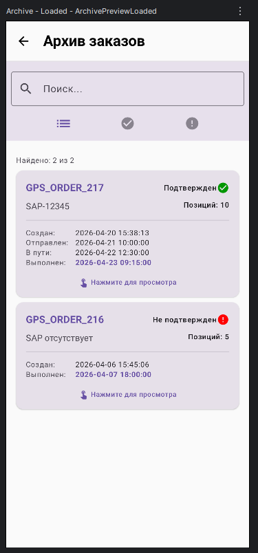 | 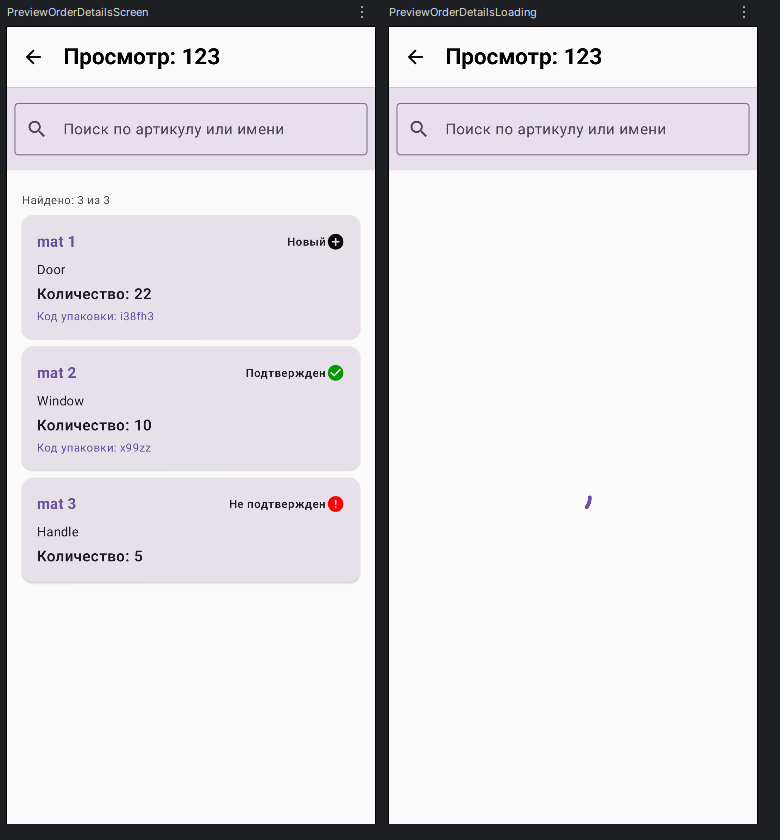 |

### UI Компоненты
| Индикатор ошибки                                         | Кастомный ActionBar                                        | Поиск и фильтрация                                               |
|----------------------------------------------------------|------------------------------------------------------------|------------------------------------------------------------------|
| 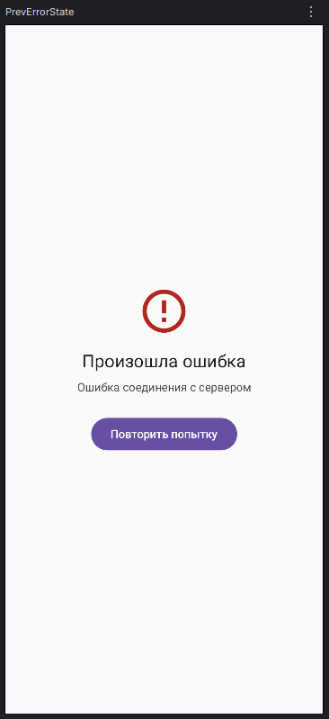 | 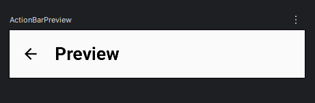 | 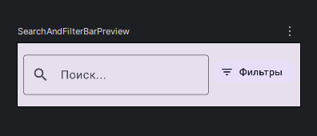 |


## Ключевые особенности реализации

### 1. Единый ViewModel (`MainViewModel`)
Вместо создания множества ViewModel для каждого экрана, используется центральный `MainViewModel`.
- Управляет состоянием всего приложения через `Sealed Class UiState`.
- Содержит логику всех сетевых запросов.
- Обрабатывает результаты сканирования и обновляет локальные списки материалов в реальном времени.

### 2. Универсальная работа со сканерами (ScannerManager)
- Поддержка различных моделей ТСД 
- Диспетчер ScannerManager, инкапсулирует работу с нативными SDK производителей.
- Honeywell AIDC SDK: Инициализирует AidcManager и BarcodeReader для устройств Honeywell.
- Zebra EMDK SDK: Использует EMDKManager и BarcodeManager для устройств Zebra.
- Предоставляет унифицированный barcodeFlow (на базе Channel), что позволяет экранам не зависеть от конкретного производителя ТСД.
- Поддерживает режим CONFLATED для пропуска лишних событий при быстром сканировании.
- При запуске на устройстве одного производителя, SDK второго производителя корректно обрабатывает ошибку инициализации и не мешает работе.

### 3. Универсальный парсинг штрихкодов (`BarcodeParser`)
Поддерживает два формата ввода:
1. **Обычные штрихкоды**: Интерпретируются как артикул материала.
2. **QR-коды с данными**: Ожидают строку в формате Base64, которая декодируется в JSON:
   ```json
   {
     "material": "ARTICUL_123",
     "code": "UNIQUE_PACK_CODE_999",
     "qty": 1
   }
   ```

### 4. Обработка ошибок (`ErrorStateView`)
Унифицированный компонент для отображения ошибок сети или сервера.
- Показывает понятное сообщение.
- Имеет кнопку "Повторить".
- Поддерживает автоматический повтор запроса через 10 секунд (опционально).

---

## Установка и запуск

### Требования
- **Android Studio**: Hedgehog или новее.
- **JDK**: 11 или выше.
- **Устройство**: Honeywell EDA52 или Zebra TC520K.
- **Доступ к API**: `http://gps-test.hmmr.ru/api/`

### Шаги по запуску

1. **Клонирование репозитория**:
   ```bash
   git clone https://git-new.hmmr.ru/timurmalyshev/android-gps-warehouse-app.git
   cd android-gps-warehouse-app
   ```

2. **Добавление библиотеки Honeywell**:
    - Убедитесь, что файл `DataCollection.aar` находится в папке `app/libs/`.
    - Если его нет, скопируйте его из официального SDK Honeywell AIDC в эту папку.
    - Проверьте `build.gradle`, что зависимость подключена:
      ```groovy
      implementation(files("libs/DataCollection.aar"))
      ```

3. **Синхронизация Gradle**:
    - Откройте проект в Android Studio.
    - Нажмите **"Sync Project with Gradle Files"**.

4. **Запуск**:
    - Подключите устройство Honeywell по USB.
    - Включите **"Отладку по USB"** в настройках разработчика на устройстве.
    - Нажмите кнопку **Run** (Shift+F10) в Android Studio.

---

## API Endpoints

Приложение взаимодействует со следующими эндпоинтами GPS RS API:

| Метод  | Endpoint          | Описание                                                                                     |
|:-------|:------------------|:---------------------------------------------------------------------------------------------|
| `GET`  | `/getkey`         | Получение публичного ключа RSA для шифрования пароля                                         |
| `POST` | `/login`          | Авторизация пользователя (возвращает JWT токен)                                              |
| `POST` | `/getinfouser`    | Получение профиля пользователя и прав на склады                                              |
| `POST` | `/getordersps`    | Список заказов (`type: status`), Архив (`type: archive`), Материалы заказа (`type: receive`) |
| `POST` | `/makeorderps`    | Создание нового заказа на перемещение                                                        |
| `POST` | `/matdoneps`      | Подтверждение приемки материала (упаковка)                                                   |
| `POST` | `/getqrps`        | Получение остатков материалов на складе (Warehouse Materials)                                |
| `POST` | `/inv_order/get`  | Список заказов инвентаризации                                                                |
| `POST` | `/inv_order_view` | Просмотр материалов в заказе инвентаризации                                                  |
| `POST` | `/inv_mob_set`    | Сверка материала при инвентаризации                                                          |
| `POST` | `/inv_order_set`  | Завершение инвентаризации                                                                    |
| `POST` | `/getwms`         | Получение данных WMS (остатки по складам)                                                    |
| `POST` | `/movewms`        | Перемещение материала между складами                                                         |
| `POST` | `/getwmsrequests` | Получение списка складских запросов                                                          |
